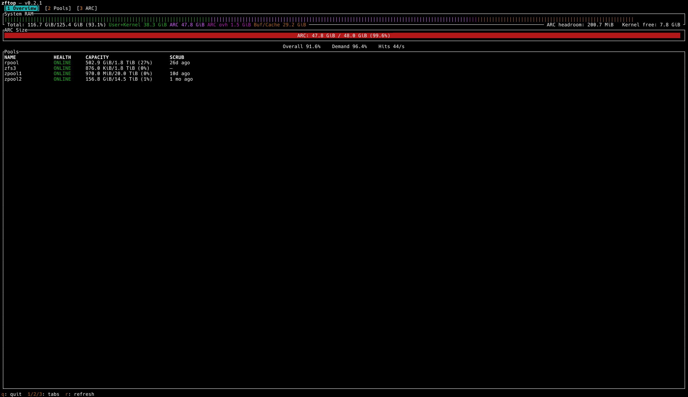

# zftop

Terminal dashboard for ZFS. Like `htop`, but for your pools.

Instead of juggling `zpool status`, `arc_summary`, `zfs list`, and `smartctl`, zftop puts it all on one screen.



## Install

```
curl -fsSL https://git.skylantix.com/rbitton/zftop/-/raw/main/install.sh | sh
```

Or grab a binary from the [releases page](https://git.skylantix.com/rbitton/zftop/-/releases), or:

```
yay -S zftop          # AUR
cargo install zftop   # crates.io (needs rustc 1.85+)
```

Already have it? `zftop --upgrade` will print the update command.

## What it shows

Three tabs, refreshing once a second:

- **Overview** — RAM bar, ARC gauge + hit ratios, pool health/capacity at a glance.
- **Pools** — pool list with health, capacity, fragmentation, scrub state, errors. `Enter` drills into the vdev tree.
- **ARC** — size gauge, MFU/MRU/metadata breakdown, hit ratios, compression ratio, throughput.

Data comes from `/proc/spl/kstat/zfs/arcstats` + `/proc/meminfo` on Linux, `sysctl` on FreeBSD. Pool data is read through `libzfs` directly without parsing `zpool`.

## Usage

```
zftop                    # default: 1s refresh
zftop -n 500             # 500ms
zftop --help             # all options
```

### Controls

| Key | Action |
|-----|--------|
| `q` / `Ctrl+C` | quit |
| `r` | force refresh |
| `1` `2` `3` `4` | Overview / Pools / Datasets / ARC |
| `Tab` / `Shift+Tab` | cycle tabs |
| `↑↓` / `jk` | select row |
| `←→` / `hl` | (Datasets) collapse / expand |
| `Enter` | drill into detail |
| `Esc` | back to list / tree |

## Requirements

- **Linux** with OpenZFS loaded, or **FreeBSD 14+**
- `libzfs` at runtime (comes with ZFS)
- Prebuilt binaries need glibc 2.28+ (Debian 10, Ubuntu 18.04, RHEL 8, Arch, etc). Older or musl systems: use `cargo install zftop`
- A Unicode-capable terminal for the dataset tree glyphs (▼/▶). Standard terminal emulators all qualify; bare Linux text consoles (`tty1`) may render the glyphs as `?`.

## How the RAM bar works

The RAM bar shows what's *currently held*, not what's reclaimable. This is intentional, and it'll look fuller than htop's bar.

**Linux:** User+Kernel | ARC (`size + overhead_size`) | Buf/Cache | Free (`MemFree`, not `MemAvailable`)

**FreeBSD:** Wired | ARC | Active | Inactive+Laundry

The "ZFS available" label on the right side is `arcstats.memory_available_bytes`: ZFS's own reclaim estimate, so you can reconcile with htop.

## Building from source

```
git clone https://git.skylantix.com/rbitton/zftop.git
cd zftop
cargo build --release
sudo install -Dm755 target/release/zftop /usr/bin/zftop
```

FreeBSD: same thing, install to `/usr/local/bin` instead. The `--source` and `--meminfo` flags are Linux-only and ignored on FreeBSD.

## Roadmap

zftop is a finishable project (or at least everything up until fleet mode, which will likely take a lot of ongoing work).

- **v0.1** ARC dashboard ✓
- **v0.2** Pools: capacity, health, vdev trees, scrub status ✓
- **v0.3** Datasets: tree view, properties, quota usage ✓
- **v0.4** Snapshots, with Sanoid retention awareness
- **v0.5** SMART health joined to vdev members
- **v1.0** Remote/fleet mode over SSH

## License

GPLv3+. See `LICENSE`.
